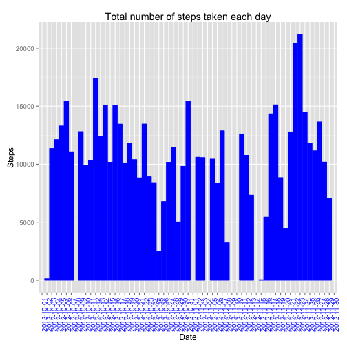
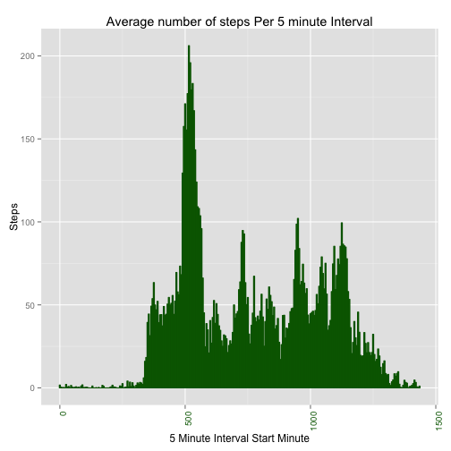
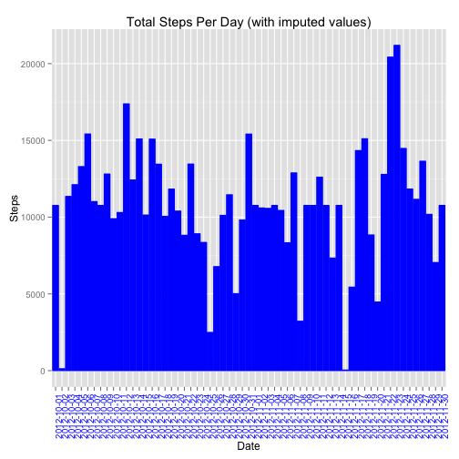
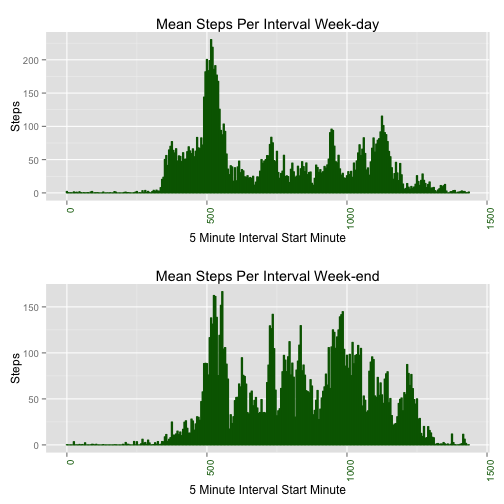

<!-- Build using: knit2html("PA1_template.Rmd") -->

This in Peer Assessment 1 for the Reproducible Research class, due on 18 January 2015.

### Utility Methods

First we'll define some utility methods for charts.


```r
library(ggplot2)
library(gridExtra)
options(warn=-1)
sumByDayPlot <- function(data,
                         title)
{
  stepSumByDay <- aggregate(data$steps, by=list(data$date), FUN=sum)
  names(stepSumByDay) = list("date", "steps")
  qplot(x=stepSumByDay$date,
        y=stepSumByDay$steps,
        xlab = "Date",
        ylab = "Steps",
        main=title,
        stat="identity",
        geom="histogram") + 
    theme(axis.text.x = element_text(angle = 90, hjust = 1, color="blue")) + 
    geom_histogram(stat="identity", color="blue", fill="blue")
}

byIntervalPlot <- function(byInterval,title)
{
  minute <- getMinutes(byInterval$interval)
  qplot(x=minute, 
        y=byInterval$steps,
        main=title,
        xlab="5 Minute Interval Start Minute",
        ylab="Steps",
        stat="identity",
        geom="histogram") + 
  theme(axis.text.x = element_text(angle = 90, hjust = 1, color="darkgreen")) + 
  geom_histogram(stat="identity", color="darkgreen", fill="darkgreen")
}

getMinutes <- function(interval)
{
  h <- floor(interval / 100)
  m <- interval %% 100
  (h * 60) + m
}
```

## Loading and pre processing the data

Next, we'll load the data and create a table called "dataFull" that only contains full observations.


```r
dataRaw <- read.csv("activity.csv")
dataFull <- dataRaw[complete.cases(dataRaw),]
```

## What is mean total number of steps taken per day?

Plot the number of steps per day from the raw data using sumByDayPlot() (defined above).


```r
sumByDayPlot(dataRaw,
             title="Total number of steps taken each day")
```

 

### What are the mean and median total number of steps taken per day?

Compute the mean and median steps per day.


```r
byDate <- aggregate(dataFull$steps, by=list(dataFull$date), FUN=sum)
names(byDate) = c("date","steps")
byDateMean <- mean(byDate$steps)
byDateMedian <- median(byDate$steps)
```

The **mean** number of steps per day is 10766.2 and the **median** is  10765.

## What is the average daily activity pattern?

Plot the number of steps per 5 minute interval.


```r
byInterval <- aggregate(dataFull$steps, by=list(dataFull$interval), FUN=mean)
names(byInterval) = c("interval","steps")
byIntervalPlot(byInterval = byInterval,
                title = "Average number of steps Per 5 minute Interval")
```

 

Determine the interval with the largest number of steps


```r
maxSteps <- max(byInterval$steps)
maxInterval <- byInterval[byInterval$steps == maxSteps, "interval"]
maxIntervalHour <- floor(maxInterval / 100)
maxIntervalMinute <- maxInterval %% 100
```

The 5-minute interval, on average across all the days in the dataset, contains the **maximum number of steps** is at 8:35 with 206.17 steps.

## Imputing missing values

Our strategy for filling in all of the missing values in the dataset, is to use replace any NA values for an interval with the average for that interval.

We'll create a new dataset that is equal to the original dataset but with the missing data filled in.


```r
byIntervalMean <- aggregate(dataFull$steps, by=list(dataFull$interval), FUN=mean)
names(byIntervalMean) = c("interval","steps")
# byIntervalPlot(byInterval = byIntervalMean,
#                 title="Mean Steps Per Interval")
missing <- 0
dataImputed <- dataRaw
for (index in 1:nrow(dataImputed))
{
  row <- dataImputed[index,]
  if (is.na(row$steps))
  {
    missing <- missing + 1
    intervalInt <- as.integer(as.character(row$interval))
    intervalHour <- floor(intervalInt / 100)
    intervalMinute <- floor(intervalInt %% 100)
    intervalMeanIndex <- 1 + (12 * intervalHour) + floor(intervalMinute / 5)
    dataImputed[index, "steps"] = byIntervalMean[intervalMeanIndex, "steps"]
  }
}
```

Note that there are 2304 **missing values**.

Now, we'll plot the number of steps per day from the imputed data.


```r
sumByDayPlot(dataImputed,
             title="Total Steps Per Day (with imputed values)")
```

 

Note that there are more values (10/1 and 11/30 stand out especially)

Now we'll check the new mean and median.


```r
byDateImputed <- aggregate(dataImputed$steps, by=list(dataImputed$date), FUN=sum)
names(byDateImputed) = c("date","steps")
byDateMeanImputed <- mean(byDateImputed$steps)
byDateMedianImputed  <- median(byDateImputed$steps)
```
After imputation, the **mean** number of steps per day is 10766.2 and the **median** is  10766.2.  Since we imputed data by average, the average value didn't change from the raw data (10766.2, however the median did: 10765).  Since imputation added fractional values, the median can now be fractional as well.

## Are there differences in activity patterns between weekdays and weekends?

Now we'll check for differences in weekday and week-end activity.


```r
dataByDay = dataImputed 
dataByDay$day <- as.POSIXlt(dataByDay$date)$wday
dataByWeekDay <- dataByDay[(0 != dataByDay$day) & (6 != dataByDay$day),] 
dataByWeekEnd <- dataByDay[(0 == dataByDay$day) | (6 == dataByDay$day),] 
byIntervalMeanWeekDay <- aggregate(dataByWeekDay$steps, by=list(dataByWeekDay$interval), FUN=mean) 
byIntervalMeanWeekEnd <- aggregate(dataByWeekEnd$steps, by=list(dataByWeekEnd$interval), FUN=mean)
names(byIntervalMeanWeekDay) = c("interval","steps")
names(byIntervalMeanWeekEnd) = c("interval","steps")
```

We'll plot the weekday and week-end plots on the same panel for a direct comparision.


```r
par(mfrow=c(1,2))
wd <- byIntervalPlot(byInterval = byIntervalMeanWeekDay,
                       title="Mean Steps Per Interval Week-day")
we <- byIntervalPlot(byInterval = byIntervalMeanWeekEnd,
                       title="Mean Steps Per Interval Week-end")
grid.arrange(wd, we, ncol=1)
```

 

Note that weekday activity starts earlier, while the weekend data starts later.  This probably reflects people exercising during the week before work, during lunch and after immediately after work.  On the weekends peoples schedules are more relaxed.  I don't know why the week-ends look spikier.
